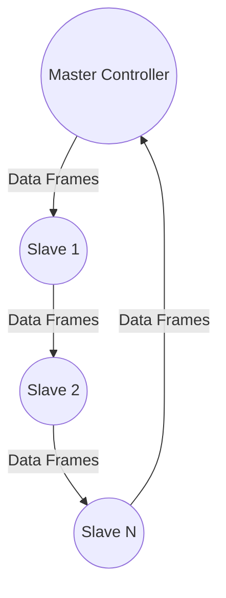

# EtherCAT Control Protocol

**Version:** V1.0  
**Date:** 2024.12

---

## Disclaimer
Thanks for choosing MYACTUATOR. Please read this statement carefully before using. Once used, this statement is deemed to be approved and accepted. Please install and use this product strictly in accordance with the manual, product description, and relevant laws, regulations, policies, and guidelines. In the process of using the product, the user undertakes to be responsible for their own behavior and all consequences arising therefrom. MYACTUATOR will not be liable for any loss caused by improper use, installation, and modification by the user.

MYACTUATOR is the trademark of Suzhou Micro Actuator Technology Co., Ltd. and its affiliates. Product names, brands, etc. appearing in this document are trademarks or registered trademarks of their respective companies. This product and manual are copyrighted by MYACTUATOR. Reproduction in any form is not permitted without permission. The final interpretation right of the disclaimer belongs to MYACTUATOR.

---

## Catalog
1. [Composition of the EtherCAT System](#composition-of-the-ethercat-system)
2. [Basic Configuration](#basic-configuration)
3. [Servo Status Control](#servo-status-control)
4. [Operating Mode Control](#operating-mode-control)
5. [Mode of Operation](#mode-of-operation)
6. [Object Dictionary](#object-dictionary)
7. [Operation Guide](#operation-guide)

---

## 1. Composition of the EtherCAT System
EtherCAT is a fieldbus protocol for real-time Ethernet communication that facilitates real-time data transmission and processing through data frames, achieving low latency and high bandwidth while maintaining low costs and a simple network structure.

EtherCAT adopts a master-slave architecture, consisting of one master device and multiple slave devices. The master sends control commands and data, while the slaves receive and execute these commands, transmitting output data such as sensor data, actuator status, and control commands in real-time. Any computer with a network interface and embedded devices with Ethernet control can serve as the master. For PC-based computers, the master controller often utilizes TwinCAT software developed by Beckhoff. Servo drives act as slaves, equipped with dedicated slave controllers. The communication cable between the master and slave must be Category 5 or higher, with a communication rate of 100Mbit/s, and the maximum communication distance between two stations is 100 meters.

**System Schematic:**

The master controller configures the functions and related object attributes of the slave controllers using the EtherCAT Slave Information (ESI) file. The ESI is an XML-formatted file that includes manufacturer information and slave controllers description information. One ESI file can contain data for multiple slave controllers. By importing the ESI file into the master controller's software, the master can identify and control each slave controller based on the configuration information in the ESI file.

---

## 2. Basic Configuration
### 2.1. Interface Definition

**EtherCAT Interface Pins:**

| Pin | Name | Description |
|-----|------|-------------|
| RX- | Receive Data - | Negative end of data reception |
| RX+ | Receive Data + | Positive end of data reception |
| TX- | Transmit Data - | Negative end of data transmission |
| TX+ | Transmit Data + | Positive end of data transmission |

### 2.2. Communication Connections
EtherCAT communication uses individually shielded twisted pair cables. The hardware connection is a daisy-chain topology.

### 2.3. ESI File Import
The ESI documents are available at: [https://www.myactuator.com](https://www.myactuator.com)

---

## 3. Servo Status Control
During EtherCAT communication, the master controller controls the servo drive according to the current actual state. The state can be changed through the control word 0x6040, and the status can be displayed through the status word 0x6041. During state transition, confirm the state change via 0x6041 before sending the next command.

### 3.1. Control Word (0x6040) Description

| Bit | Name | Description |
|-----|------|-------------|
| 0   | Switch on | 1-valid, 0-invalid |
| 1   | Enable Voltage | 1-valid, 0-invalid |
| 2   | Quick Stop | 0-valid (quick stop), 1-invalid |
| 3   | Enable Operation | 1-valid, 0-invalid |
| 4~6 | Operation Mode Specific | Related to Each Servo Operation Mode |
| 7~8 | Reserve | No Define |
| 9   | Operation Mode Specific | Related to Each Servo Operation Mode |
| 10~15 | Reserve | No Define |

### 3.2. Status Word (0x6041) Description

| Bit | Name | Description |
|-----|------|-------------|
| 0   | Ready to Switch on | 1-valid, 0-invalid |
| 1   | Switched on | 1-valid, 0-invalid |
| 2   | Operation Enabled | 1-valid, 0-invalid |
| 3   | Fault | 1-valid, 0-invalid |
| 4   | Voltage Enabled | 1-valid, 0-invalid |
| 5   | Quick Stop | 1-valid, 0-invalid |
| 6   | Switch on Disabled | 1-valid, 0-invalid |
| 7   | Warning | 1-valid, 0-invalid |
| 8   | Reserve | No Define |
| 9   | Remote | 1-valid, 0-invalid |
| 10  | Target Reach | 1-valid, 0-invalid |
| 11  | Internal Limit Active | 1-valid, 0-invalid |
| 12~13 | Operation Mode Specific | Related to Each Servo Operation Mode |
| 14~15 | Reserve | No Define |

---

## 4. Operating Mode Control
There are three modes: Cyclic Synchronous Position (CSP), Cyclic Synchronous Velocity (CSV), and Cyclic Synchronous Torque (CST). Set the desired mode using object 0x6060. The current mode is displayed using 0x6061.

### 4.1. Operating Mode Settings (0x6060)

| Value | Mode of Operation |
|-------|-------------------|
| 0x08  | Cyclic Synchronous Position Mode |
| 0x09  | Cyclic Synchronous Velocity Mode |
| 0x0A  | Cyclic Synchronous Torque Mode |

### 4.2. Operating Mode Display (0x6061)

| Value | Operating Mode Display |
|-------|-----------------------|
| 0x08  | Cyclic Synchronous Position Mode |
| 0x09  | Cyclic Synchronous Velocity Mode |
| 0x0A  | Cyclic Synchronous Torque Mode |

---

## 5. Mode of Operation
### 5.1. Cyclic Synchronous Position Mode
- **Set 0x6060=8**
- Master sends target position, velocity offset, and torque offset each cycle.

#### Control Word (0x6040) in CSP
| Bit | Name | Description |
|-----|------|-------------|
| 0   | Switch on | 1-valid, 0-invalid |
| 1   | Enable Voltage | 1-valid, 0-invalid |
| 2   | Quick Stop | 0-valid, quick stop; 1-invalid |
| 3   | Enable Operation | 1-valid, 0-invalid |
| 4~6 | CSP mode reservation | No Define |
| 7~8 | Reserve | No Define |
| 9   | CSP mode reservation | No Define |
| 10~15 | Reserve | No Define |

#### Status Word (0x6041) in CSP
| Bit | Name | Description |
|-----|------|-------------|
| 0   | Ready to Switch on | 1-valid, 0-invalid |
| 1   | Switched on | 1-valid, 0-invalid |
| 2   | Operation Enabled | 1-valid, 0-invalid |
| 3   | Fault | 1-valid, 0-invalid |
| 4   | Voltage Enabled | 1-valid, 0-invalid |
| 5   | Quick Stop | 1-valid, 0-invalid |
| 6   | Switch on Disabled | 1-valid, 0-invalid |
| 7   | Warning | 1-valid, 0-invalid |
| 8   | Reserve | No Define |
| 9   | Remote | 1-valid, 0-invalid |
| 10  | Target Reach | 1-valid, 0-invalid |
| 11  | Internal Limit Active | 1-valid, 0-invalid |
| 12  | Follow the target location | 1-already followed, 0-not followed |
| 13  | Follow the position error alarm | 1-position deviation alarm, 0-no alarm |
| 14~15 | Reserve | No Define |

#### Control Steps (CSP)
1. Set 0x6060=8 (CSP mode)
2. Read 0x6064 (position actual value), set 0x607A (target position) to current value
3. Set 0x6040:
   - 0x6040=6: Disabled
   - 0x6040=7: Ready to enable
   - 0x6040=15: Enable
4. Periodically send 0x607A (target position)

### 5.2. Cyclic Synchronous Velocity Mode
- **Set 0x6060=9**
- Master sends target speed, speed offset, and torque offset each cycle.

#### Control Word (0x6040) in CSV
| Bit | Name | Description |
|-----|------|-------------|
| 0   | Switch on | 1-valid, 0-invalid |
| 1   | Enable Voltage | 1-valid, 0-invalid |
| 2   | Quick Stop | 0-valid, quick stop; 1-invalid |
| 3   | Enable Operation | 1-valid, 0-invalid |
| 4~6 | CSV mode reservation | No Define |
| 7~8 | Reserve | No Define |
| 9   | CSV mode reservation | No Define |
| 10~15 | Reserve | No Define |

#### Status Word (0x6041) in CSV
| Bit | Name | Description |
|-----|------|-------------|
| 0   | Ready to Switch on | 1-valid, 0-invalid |
| 1   | Switched on | 1-valid, 0-invalid |
| 2   | Operation Enabled | 1-valid, 0-invalid |
| 3   | Fault | 1-valid, 0-invalid |
| 4   | Voltage Enabled | 1-valid, 0-invalid |
| 5   | Quick Stop | 1-valid, 0-invalid |
| 6   | Switch on Disabled | 1-valid, 0-invalid |
| 7   | Warning | 1-valid, 0-invalid |
| 8   | Reserve | No Define |
| 9   | Remote | 1-valid, 0-invalid |
| 10  | CSV mode reservation | No Define |
| 11  | Internal Limit Active | 1-valid, 0-invalid |
| 12  | Follow the target velocity | 1-already followed, 0-not followed |
| 13  | CSV mode reservation | No Define |
| 14~15 | Reserve | No Define |

#### Control Steps (CSV)
1. Set 0x6060=9 (CSV mode)
2. Set 0x60FF=0 (target speed) for safety
3. Set 0x6040:
   - 0x6040=6: Disabled
   - 0x6040=7: Ready to enable
   - 0x6040=15: Enable
4. Set 0x60FF (target speed)

### 5.3. Cyclic Synchronous Torque Mode
- **Set 0x6060=10**
- Master sends target torque and torque offset each cycle.

#### Control Word (0x6040) in CST
| Bit | Name | Description |
|-----|------|-------------|
| 0   | Switch on | 1-valid, 0-invalid |
| 1   | Enable Voltage | 1-valid, 0-invalid |
| 2   | Quick Stop | 0-valid, quick stop; 1-invalid |
| 3   | Enable Operation | 1-valid, 0-invalid |
| 4~6 | CST mode reservation | No Define |
| 7~8 | Reserve | No Define |
| 9   | CST mode reservation | No Define |
| 10~15 | Reserve | No Define |

#### Status Word (0x6041) in CST
| Bit | Name | Description |
|-----|------|-------------|
| 0   | Ready to Switch on | 1-valid, 0-invalid |
| 1   | Switched on | 1-valid, 0-invalid |
| 2   | Operation Enabled | 1-valid, 0-invalid |
| 3   | Fault | 1-valid, 0-invalid |
| 4   | Voltage Enabled | 1-valid, 0-invalid |
| 5   | Quick Stop | 1-valid, 0-invalid |
| 6   | Switch on Disabled | 1-valid, 0-invalid |
| 7   | Warning | 1-valid, 0-invalid |
| 8   | Reserve | No Define |
| 9   | Remote | 1-valid, 0-invalid |
| 10  | CST mode reservation | No Define |
| 11  | Internal Limit Active | 1-valid, 0-invalid |
| 12  | Follow the target velocity | 1-already followed, 0-not followed |
| 13  | CST mode reservation | No Define |
| 14~15 | Reserve | No Define |

#### Control Steps (CST)
1. Set 0x6060=10 (CST mode)
2. Set 0x6071=0 (target torque) for safety
3. Set 0x6040:
   - 0x6040=6: Disabled
   - 0x6040=7: Ready to enable
   - 0x6040=15: Enable
4. Set 0x607 (target torque)

---

## 6. Object Dictionary
### 6.1. 0x6040 Control Word
| Field | Value |
|-------|-------|
| Data Type | UINT |
| Default Data | 0x0000 |
| Max Data | 0xFFFF |
| Min Data | 0x0000 |
| Access | RW |
| Backup | YES |
| Update | Immediately |
| PDO Mapping | RxPDO |

**Bit Meaning:**
- 0: Switch on
- 1: Enable voltage
- 2: Quick stop
- 3: Operation enable
- 4~6: Mode specific
- 7~8: Reserved
- 9: Mode specific
- 10~15: Reserved

### 6.2. 0x6041 Status Word
| Field | Value |
|-------|-------|
| Data Type | UINT |
| Default Data | 0x0000 |
| Max Data | 0xFFFF |
| Min Data | 0x0000 |
| Access | RO |
| Backup | NO |
| Update | \ |
| PDO Mapping | TxPDO |

**Bit Meaning:**
- 0: Ready to switch on
- 1: Switch on
- 2: Operation enable
- 3: Fault
- 4: Enable voltage
- 5: Quick stop
- 6: Switch on disabled
- 7: Warning
- 8: Reserved
- 9: Remote
- 10: Target reached
- 11: Internal limit active
- 12~13: Operation mode specific
- 14~15: Reserved

### 6.3. 0x6060 Operating Mode Settings
| Field | Value |
|-------|-------|
| Data Type | SINT |
| Default Data | 0x08 |
| Max Data | 0x0A |
| Min Data | 0x00 |
| Access | RW |
| Backup | YES |
| Update | Immediately |
| PDO Mapping | RxPDO |

| Value | Operating mode |
|-------|---------------|
| 0x08  | Cyclic synchronous position mode |
| 0x09  | Cyclic synchronous velocity mode |
| 0x0A  | Cyclic synchronous torque mode |

### 6.4. 0x6061 Operating Mode Display
| Field | Value |
|-------|-------|
| Data Type | SINT |
| Default Data | 0x08 |
| Max Data | 0x0A |
| Min Data | 0x00 |
| Access | RO |
| Backup | NO |
| Update | \ |
| PDO Mapping | TxPDO |

| Value | Operating mode |
|-------|---------------|
| 0x08  | Cyclic synchronous position mode |
| 0x09  | Cyclic synchronous velocity mode |
| 0x0A  | Cyclic synchronous torque mode |

### 6.5. 0x6064 Position Actual Value
| Field | Value |
|-------|-------|
| Data Type | DINT |
| Default Data | 0x00000000 |
| Max Data | 0x7FFFFFFF |
| Min Data | 0x80000000 |
| Access | RO |
| Backup | NO |
| Unit | plus |
| Update | \ |
| PDO Mapping | TxPDO |

Description: Indicates the actual location of the encoder feedback at the output.

### 6.6. 0x6077 Torque Actual Value
| Field | Value |
|-------|-------|
| Data Type | INT |
| Default Data | 0x0000 |
| Max Data | 0x7FFF |
| Min Data | 0x8000 |
| Access | RO |
| Backup | NO |
| Unit | 0.1% |
| PDO Mapping | TxPDO |

Note: Indicates the instantaneous torque of the motor, measured in thousandths of the rated current.

### 6.7. 0x607A Target Position
| Field | Value |
|-------|-------|
| Data Type | DINT |
| Default Data | 0x00000000 |
| Max Data | 0x7FFFFFFF |
| Min Data | 0x80000000 |
| Access | RW |
| Backup | YES |
| Update | Immediately |
| Unit | plus |
| PDO Mapping | RxPDO |

Description: The target location is the set position to which the drive should be moved in periodic synchronous position mode.

### 6.8. 0x60B0 Position Offset
| Field | Value |
|-------|-------|
| Data Type | DINT |
| Default Data | 0x00000000 |
| Max Data | 0x7FFFFFFF |
| Min Data | 0x80000000 |
| Access | RW |
| Backup | YES |
| Update | Immediately |
| Unit | plus |
| PDO Mapping | RxPDO |

Description: Indicates the position offset value between the target position and the actual position when the motor is stopped.

### 6.9. 0x60B1 Velocity Offset
| Field | Value |
|-------|-------|
| Data Type | DINT |
| Default Data | 0x00000000 |
| Max Data | 0x7FFFFFFF |
| Min Data | 0x80000000 |
| Access | RW |
| Backup | YES |
| Update | Immediately |
| Unit | plus/s |
| PDO Mapping | RxPDO |

Description: Takes the speed command value from the master controller and then adds it to the command of the speed ring, including the input amount of speed feedforward in CSP mode; Contains the offset of the drive device speed instruction in CSV mode.

### 6.10. 0x60B2 Torque Offset
| Field | Value |
|-------|-------|
| Data Type | INT |
| Default Data | 0x0000 |
| Max Data | 0x7FFF |
| Min Data | 0x8000 |
| Access | RW |
| Backup | YES |
| Update | Immediately |
| Unit | per thousand of rated current |
| PDO Mapping | RxPDO |

Explanation: Takes the torque command value from the master controller and then adds it to the command of the current loop, including the input amount of torque feed forward in CSP mode; Include the additional torque of the drive instruction in CST mode and add it to the target torque.

### 6.11. 0x606C Velocity Actual Value
| Field | Value |
|-------|-------|
| Data Type | DINT |
| Default Data | 0x00000000 |
| Max Data | 0x7FFFFFFF |
| Min Data | 0x80000000 |
| Access | RO |
| Backup | NO |
| Update | \ |
| Unit | plus/s |
| PDO Mapping | TxPDO |

Description: Velocity coupling with the input of the speed controller.

---

## 7. Operation Guide
### 7.1. Connect
1. In TwinCAT Project, right-click Devices, select Scan.
2. Follow dialog prompts (OK, Yes, OK).
3. Configure I/O Ports and connect virtual axes.
4. Activate Free Run.
5. After scan, found device appears in Solution Explorer.
6. Choose Drive 1 (ET1100-uC16), enter DC interface, set Operation Mode to DC-Synchron.
7. Restart TwinCAT.

### 7.2. Position Loop Mode
1. Select ModeOfOperation in Module 1, go to Online interface.
2. Write 8 to ModeOfOperation for position mode.
3. Set Max Torque (default: 10A, unit: 1/1000 of rated current).
4. Set TargetPosition (-65535~65535; 0=0°, 65535=180°, -65535=-180°).
5. Write 15 to ControlWord to start, 0 to stop.
6. Check ActualPosition to verify target reached.

### 7.3. Speed Loop Mode
1. Select ModeOfOperation in Module 1, go to Online interface.
2. Write 9 to ModeOfOperation for speed mode.
3. Set Max Torque (default: 10A, unit: 1/1000 of rated current).
4. Set TargetVelocity (pulse/s). RPM = (X * 60 / 131072).
5. Write 15 to ControlWord to start, 0 to stop.
6. Check ActualVelocity to verify speed reached.

### 7.4. Current Loop Mode
1. Select ModeOfOperation in Module 1, go to Online interface.
2. Write 10 to ModeOfOperation for current mode.
3. Set Max Torque (default: 10A, unit: 1/1000 of rated current).
4. Set Target Torque (unit: 1/1000 of rated current).
5. Write 15 to ControlWord to start, 0 to stop.

---

*End of Document*