# LDR Humanoid Arm System - Architecture Diagrams

This document provides visual architecture diagrams using Mermaid syntax that can be rendered in GitHub, VS Code, or online tools.

---

## 1. System Overview Diagram


---

## 2. Package Dependency Graph


---

## 3. Control Architecture - Dual Path

```mermaid
graph TB
    subgraph "User Code"
        Simple[Simple Control<br/>motion_planner.py<br/><br/>- Direct joint control<br/>- Fast execution<br/>- Known trajectories]

        Advanced[MoveIt Control<br/>moveit_py<br/><br/>- IK solving<br/>- Collision avoidance<br/>- Cartesian planning]
    end

    Action[/arm_controller/<br/>follow_joint_trajectory<br/><br/>FollowJointTrajectory Action]

    subgraph "ros2_control"
        CM[Controller Manager]

        subgraph "Controllers"
            JSB[joint_state_broadcaster<br/>50 Hz]
            ArmC[arm_controller<br/>JointTrajectoryController<br/>6 arm joints]
            HandC[hand_controller<br/>GripperActionController<br/>2 gripper fingers]
        end
    end

    HW[Hardware Abstraction<br/>GazeboSimROS2ControlPlugin<br/>OR<br/>HardwareInterface]

    Phys[Physical Layer<br/>Gazebo Harmonic<br/>OR<br/>Real Robot Motors]

    Simple --> Action
    Advanced --> Action

    Action --> ArmC

    ArmC --> CM
    HandC --> CM
    JSB --> CM

    CM --> HW
    HW --> Phys

    style Simple fill:#8BC34A
    style Advanced fill:#03A9F4
    style Action fill:#FF9800
    style CM fill:#9C27B0,color:#fff
```

---

## 4. Data Flow - Topics and Actions

```mermaid
graph LR
    subgraph "Sensors"
        Camera[RGBD Camera<br/>Gazebo Plugin]
    end

    subgraph "Topics Published"
        RGB[/camera/color/image_raw<br/>sensor_msgs/Image]
        Depth[/camera/depth/image_raw<br/>sensor_msgs/Image]
        PCL[/camera/depth/points<br/>sensor_msgs/PointCloud2]
        JS[/joint_states<br/>sensor_msgs/JointState]
        TF[/tf, /tf_static<br/>tf2_msgs/TFMessage]
    end

    subgraph "Perception"
        PN[perception_node<br/>Point cloud processing]
        ObjDet[/detected_objects<br/>MarkerArray]
    end

    subgraph "MoveIt"
        PSU[planning_scene_updater]
        PS[/planning_scene<br/>PlanningScene]
        MG[move_group<br/>Planning Server]
    end

    subgraph "Controllers"
        RSP[robot_state_publisher]
        ArmCtrl[arm_controller]
    end

    Camera --> RGB
    Camera --> Depth
    Camera --> PCL

    PCL --> PN
    PN --> ObjDet
    ObjDet --> PSU
    PSU --> PS
    PS --> MG

    ArmCtrl --> JS
    JS --> RSP
    RSP --> TF

    TF --> MG

    style Camera fill:#4CAF50
    style PN fill:#9C27B0,color:#fff
    style MG fill:#2196F3,color:#fff
    style ArmCtrl fill:#FF5722,color:#fff
```

---

## 5. Launch File Hierarchy


---

## 6. Perception Pipeline Flow


---

## 7. Robot Model Structure (URDF)


---

## 8. TF Transform Tree


---

## 9. Controller Lifecycle State Machine


---

## 10. MoveIt Planning Pipeline

```mermaid
graph TB
    Start[Planning Request<br/>Goal pose/joints]

    subgraph "Planning Scene"
        PS[Get Current State<br/>/joint_states]
        Coll[Load Collision Objects<br/>OctoMap + static]
    end

    IK{Goal type?}

    IKSolve[IK Solver KDL<br/>Cartesian → Joint]

    subgraph "Motion Planning"
        OMPL[OMPL Planner<br/>RRT*/PRM/etc.]
        Pilz[Pilz Planner<br/>LIN/PTP/CIRC]
        CHOMP[CHOMP<br/>Gradient-based]
    end

    Valid{Valid plan?}

    subgraph "Trajectory Processing"
        Smooth[Smoothing<br/>Time parameterization]
        Limit[Apply Limits<br/>Velocity/acceleration]
    end

    Execute[Execute<br/>Send to arm_controller]

    Monitor[Execution Monitor<br/>Track progress]

    Success{Success?}

    Done[Plan Complete]
    Fail[Plan Failed]

    Start --> PS
    PS --> Coll
    Coll --> IK

    IK -->|Cartesian| IKSolve
    IK -->|Joint| OMPL
    IKSolve --> OMPL

    OMPL --> Valid
    Pilz --> Valid
    CHOMP --> Valid

    Valid -->|Yes| Smooth
    Valid -->|No| Fail

    Smooth --> Limit
    Limit --> Execute
    Execute --> Monitor
    Monitor --> Success

    Success -->|Yes| Done
    Success -->|No| Fail

    style Start fill:#4CAF50
    style Done fill:#8BC34A
    style Fail fill:#F44336,color:#fff
    style Execute fill:#FF9800
```



---

## 11. Deployment Architecture - Simulation


---

## 12. Deployment Architecture - Real Hardware (Future)


---

## 13. Build System Flow


---

## 14. Modular vs All-in-One Launch Strategy


---

## 15. Timing Sequence Diagram - System Startup


---

**End of Architecture Diagrams**

## Usage

### Viewing Diagrams

**GitHub:** These diagrams will render automatically when viewing this file on GitHub.

**VS Code:** Install the "Markdown Preview Mermaid Support" extension to see diagrams in preview.

**Online:** Copy diagram code blocks to https://mermaid.live for interactive editing.

**Export:** Use mermaid-cli to export diagrams to PNG/SVG:
```bash
npm install -g @mermaid-js/mermaid-cli
mmdc -i ARCHITECTURE_DIAGRAMS.md -o architecture_diagrams.pdf
```

### Diagram Legend

- **Green**: Active/functional components
- **Blue**: Core system components
- **Gray**: Placeholder/future components
- **Orange**: Configuration/intermediate
- **Purple**: Perception/advanced features
- **Red**: Critical/important components
